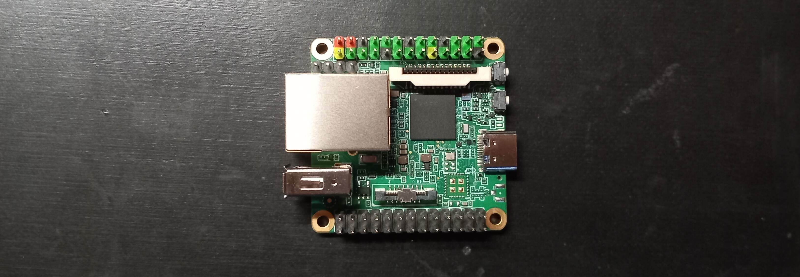

# milkV Duo S

User guide: https://milkv.io/docs/duo/getting-started/duos

## Info

- SoC: SG2000
- RISC-V CPU: C906@1Ghz + C906@700MHz
- ARM CPU: 1xCortex-A53 @ 1GHz
- MCU: 8051@8KB SRAM
- Memory: SIP DRAM 512MB
- TPU: 0.5TOPS@INT8
- Storage: 1x microSD connector
- USB: 1x Type-C for power and data or 1x USB 2.0 A Port HOST
- Ethernet 100Mbps ethernet port(RJ45) onboard

## Installation

Download the pre-built image from the official github:

    https://github.com/milkv-duo/duo-buildroot-sdk-v2/releases/

Once you downloaded an image `milkv-duos-*.img.zip`, you can unzip it and copy
it to an SD card. Then connect the board to your PC via the USB-C peripheral,
which uses USB networking:

```
ssh root@192.168.42.1
```

- The password is `milkv`
